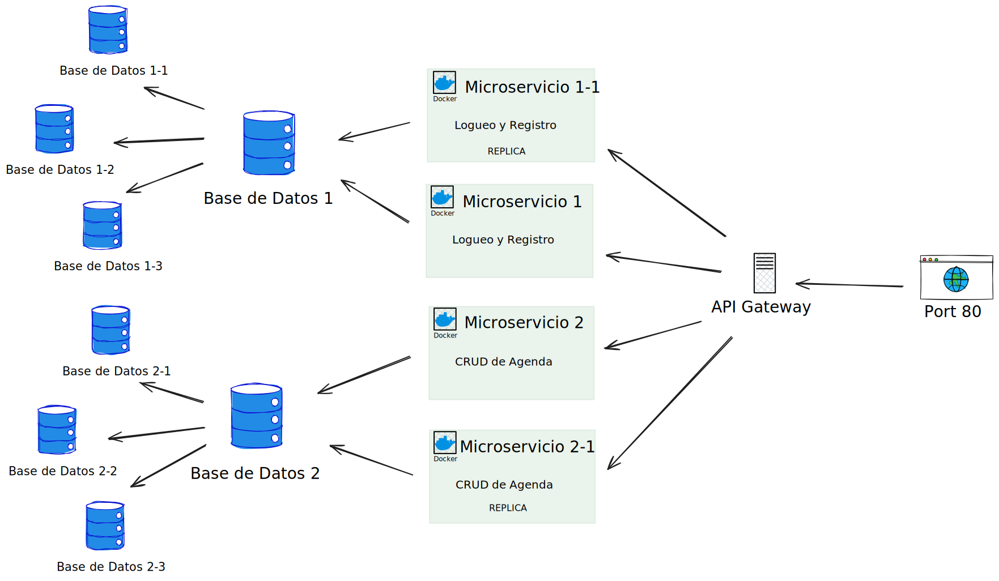

# Backend del Sistema de Agenda con Sistemas Distribuidos

Backend del sistema creado en la materia de Sistemas Distribuidos en el 8vo semestre de la carrera de Ingenieria en Sistemas Computacionales.


## Stack Tecnológico

- **Base de datos:** MongoDB
- **Microservicios:** Docker
- **Lenguaje:** JavaScript
- **Backend:** Node.js

## Herramientas de desarrollo

- **Visual Studio Code**
- **Postman**
- **Linux**
- **Docker**

## División de microservicios

### Microservicio_1

En este microservicio se realiza la parte de logueo, usando `bycrypt`  para poder tener una mejor seguridad con el hasheo de contraseñas, ademas de usar `jwt` para poder crear un token de logueo.

### Microservicio_2

En este, una vez ya logueados vamos a poder crear, eliminar, modificar y obtener contactos por medio de la api que se creo, es decir un tipo CRUD. Esto lo podemos proar hacieno uso de **Postman** pasandole el token de logueo por la parte de header

## API Gateway

Estamos haciendo uso de **Ngnix** para crear la API Gateway, todas estas configuraciones se encuentran en el archivo de ```nginx.conf``` dentro de la carpeta de **nginx**

## Diagrama de Arquitectura del sistema

